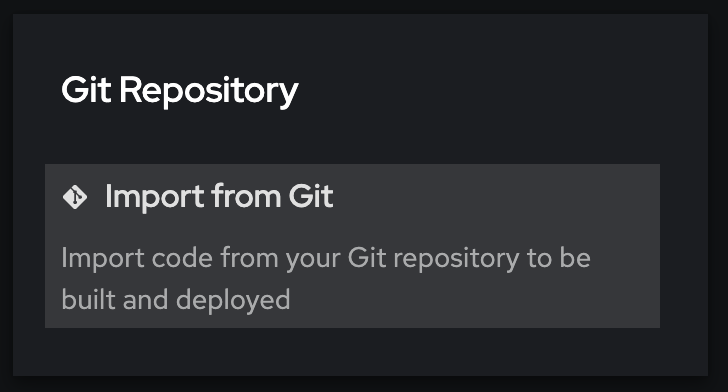
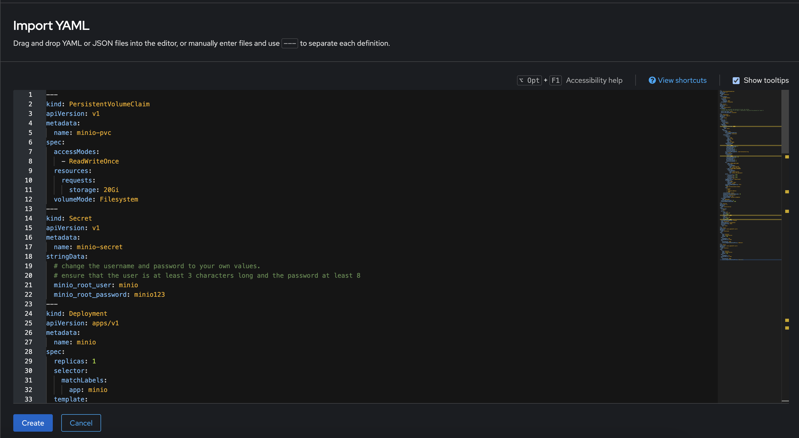
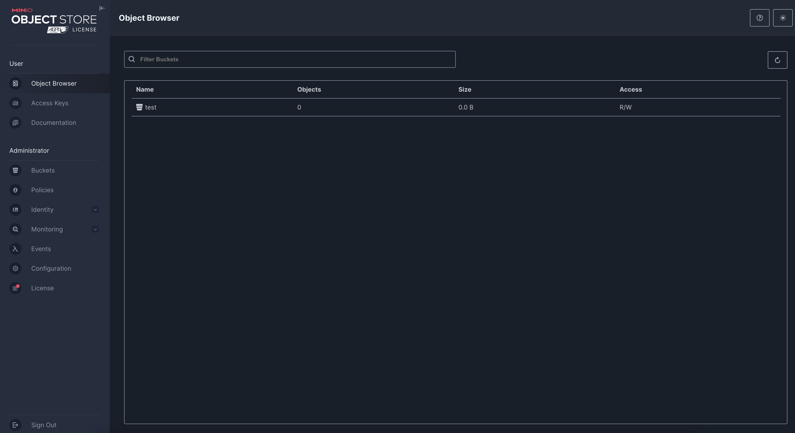
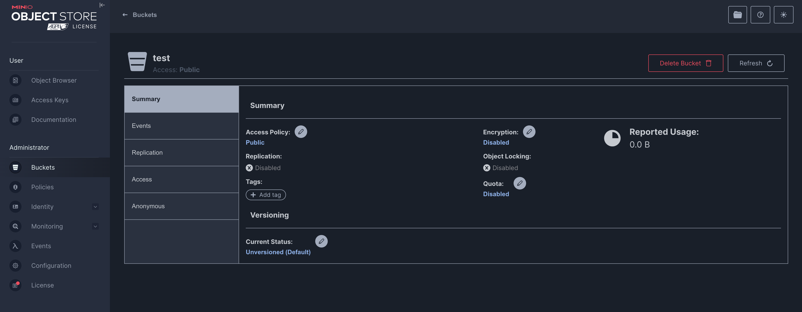

# nginx-njs
This Container image is to address the lack of supportability of the njs module by the offical nginx image provided by Red hat.

## How it works
When trying to install the RPM package of the njs module, it complains about the lack of the corresponding nginx package and does not complete the installation. Nginx is installed, but through the base image and not via RPM. To satisfy the dependency requirement and allow the installation of the other packages, we built a dummy (no files installed) nginx RPM package.

## Build Command Example
At the project-root directory run: `podman build . -t <image name>`

## Run Command Example
`podman run -d -p 8080:8080 <image name>`

## Running on Openshift
Inside developer context click `Add+` and the choose `Import from Git` as the image below: 

In Git Repo Url paste the url: `https://github.com/LeandroJan/nginx-njs.git` and click `Create`

After that, click on the plus sign upperright  tcorner to import from YAML and paste de minio.yaml file provided by this repo as showed by the images below:

 

Finally when all the resources are created the nginx pod will go dark blue and you can access de minio through the console url generated by the openshift router. The user and the password are listed inside the minio.yaml

Within the Minio create the bucket and name it test:

and set the Access Policy to Public:

Finally add the static html file inside the bucket named test and try to access then directly from the nginx exposed route.

Important note: if you want to change the bucket name it is possible. The name test is hardcoded inside nignx.conf  and change the at the url of the proxy_pass command:
`location /s3/ {
        proxy_pass http://minio-service:9000/test/;
        proxy_set_header Host $host;
    }`