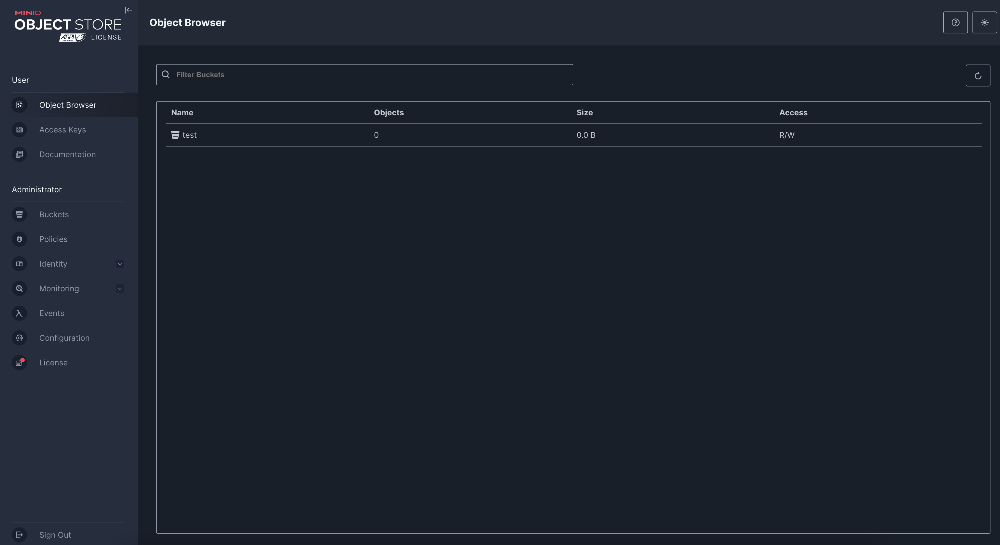

# nginx-njs
This container image facilitates the installation of the njs module in the official NGINX image provided by Red Hat.

## How It Works
When attempting to install the RPM package for the njs module, the installation fails due to the absence of a corresponding nginx RPM package. Although nginx is installed through the base image, it is not installed via RPM.  

To resolve this, we created a dummy nginx RPM package (which does not install any files) to satisfy the dependency requirement, enabling the installation of other packages.

## Running on OpenShift
1. Inside the Developer context, click `Add+` and select `Import from Git`, as shown below:  


2. In the Git Repo URL field, paste the following URL:  
```  
https://github.com/LeandroJan/nginx-njs.git
```  
Then click `Create`.  

3. After the project is created, click the "+" icon in the upper-right corner to import from YAML. Paste the contents of the `minio.yaml` file provided in this repository. Refer to the images below for guidance:  

 

4. Once the resources are created, the nginx pod will turn dark blue, indicating it is running. Access Minio through the console URL generated by the OpenShift router. The username and password are available in the `minio.yaml` file.  

5. In Minio, create a bucket and name it `test`:  



6. Set the bucket’s access policy to Public:  


7. Upload a static HTML file to the `test` bucket, and you should be able to access it directly through the nginx exposed route.

8. Access the static content in the bucket using the URL provided by the NGINX pod, appending the name of the HTML file to the URL.

## Important Notes
- If you wish to change the bucket name, you can do so.  
- The name `test` is hardcoded in the `nginx.conf` file. Update the bucket name in the following section by modifying the `proxy_pass` URL:  

```nginx
location /s3/ {
    proxy_pass http://minio-service:9000/<new-bucket-name>/;
    proxy_set_header Host $host;
}
```